<div align="center">

# 🎨 Pixel Art Generator — LoRA Fine-Tuning Pipeline

**An end-to-end machine learning pipeline for fine-tuning Stable Diffusion v1.5 to generate high-fidelity pixel art on a consumer-grade GPU.**


-76B900?logo=nvidia&logoColor=white)


*Fine-tuned on ~13,000 pixel art images using LoRA (Low-Rank Adaptation) with extreme memory optimizations to run on a 6GB VRAM laptop GPU.*

</div>

---

## 📑 Table of Contents

- [Overview](#-overview)
- [Pipeline Architecture](#-pipeline-architecture)
- [Sample Results](#-sample-results)
- [Project Structure](#-project-structure)
- [Step-by-Step Guide](#-step-by-step-guide)
  - [Step 1: Environment Setup](#step-1-environment-setup)
  - [Step 2: Dataset Collection](#step-2-dataset-collection)
  - [Step 3: AI-Powered Image Captioning](#step-3-ai-powered-image-captioning)
  - [Step 4: Dataset Preparation & Preprocessing](#step-4-dataset-preparation--preprocessing)
  - [Step 5: Caption Cleaning & Normalization](#step-5-caption-cleaning--normalization)
  - [Step 6: LoRA Fine-Tuning](#step-6-lora-fine-tuning)
  - [Step 7: Inference & Generation](#step-7-inference--generation)
  - [Step 8: Web Application](#step-8-web-application)
- [Training Configuration](#-training-configuration)
- [Memory Optimization Techniques](#-memory-optimization-techniques)
- [Technologies Used](#-technologies-used)
- [Acknowledgements](#-acknowledgements)

---

## 🔭 Overview

This project demonstrates how to fine-tune a **Stable Diffusion v1.5** model to generate **pixel art** using **LoRA (Low-Rank Adaptation)** — all on a consumer-grade **NVIDIA RTX 4050 Laptop GPU** with only **6GB of VRAM**.

The pipeline covers the complete ML lifecycle:

1. **Raw data ingestion** from multiple pixel art datasets
2. **AI-powered captioning** using Gemini, NVIDIA, and local Ollama models
3. **Data preprocessing** with standardization and metadata generation
4. **Low-VRAM LoRA training** with extreme memory optimizations
5. **Inference testing** comparing base vs. fine-tuned model outputs
6. **Web applications** (Flask + custom frontend, Streamlit) for interactive generation

> **Key Achievement:** Training a diffusion model that would normally require 24GB+ VRAM on a 6GB GPU through careful engineering of gradient checkpointing, 8-bit optimizers, mixed-precision training, and LoRA weight injection.

---

## 🏗 Pipeline Architecture

```
┌─────────────────────────────────────────────────────────────────────┐
│                        PIXEL ART LORA PIPELINE                      │
├─────────────────────────────────────────────────────────────────────┤
│                                                                     │
│  ┌──────────────┐     ┌──────────────┐     ┌──────────────────┐     │
│  │  RAW IMAGES  │────▶│  AI CAPTION  │────▶│  PREPROCESSING   │     │
│  │  (~13K imgs) │     │  (3 engines) │     │  512×512 + JSONL │     │
│  └──────────────┘     └──────────────┘     └────────┬─────────┘     │
│                                                      │              │
│                                                      ▼              │
│  ┌──────────────┐     ┌──────────────┐     ┌──────────────────┐     │
│  │   WEB APPS   │◀────│   INFERENCE  │◀────│  LORA TRAINING   │     │
│  │ Flask/Strlit │     │ GPU Pipeline │     │ 8bit AdamW + AMP │     │
│  └──────────────┘     └──────────────┘     └──────────────────┘     │
│                                                                     │
└─────────────────────────────────────────────────────────────────────┘
```

---

## 🖼 Sample Results

### Fine-Tuned Model Outputs

Below are sample images generated by the fine-tuned model using various prompts:

<div align="center">
<table>
<tr>
<td align="center">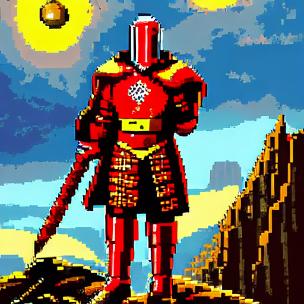<br/><sub><b>Pixel Art Scene</b></sub></td>
<td align="center">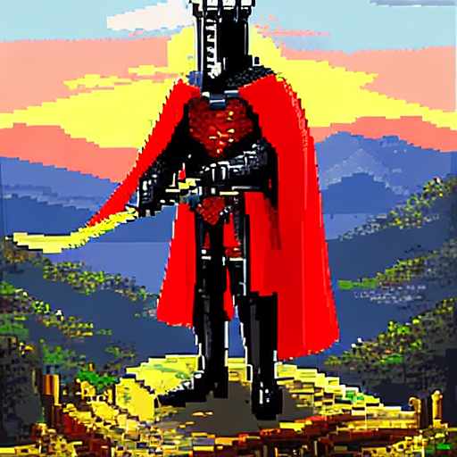<br/><sub><b>Pixel Art Scene</b></sub></td>
<td align="center">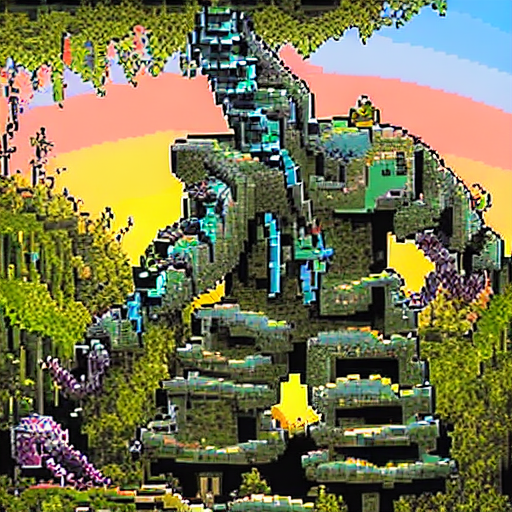<br/><sub><b>Pixel Art Scene</b></sub></td>
</tr>
<tr>
<td align="center">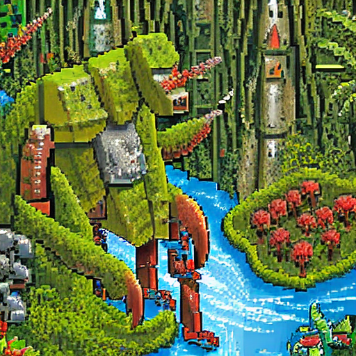<br/><sub><b>Pixel Art Scene</b></sub></td>
<td align="center">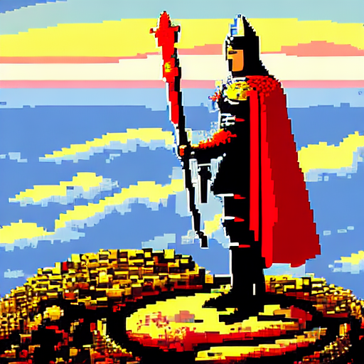<br/><sub><b>Pixel Art Scene</b></sub></td>
<td align="center">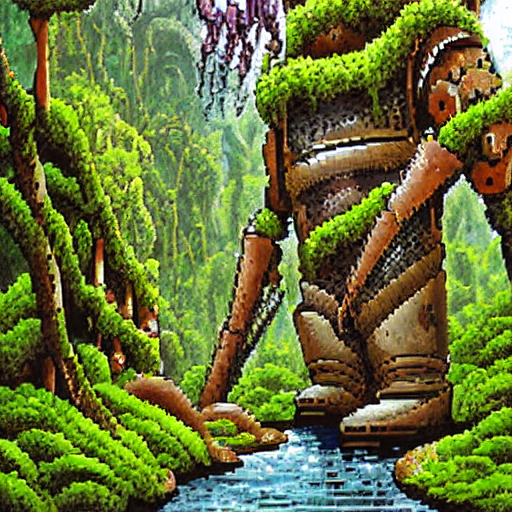<br/><sub><b>Pixel Art Scene</b></sub></td>
</tr>
<tr>
<td align="center">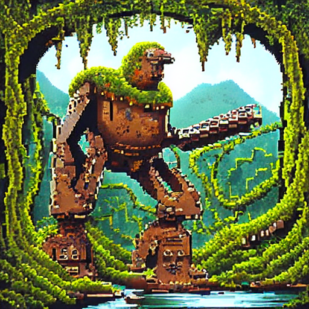<br/><sub><b>Pixel Art Scene</b></sub></td>
<td align="center">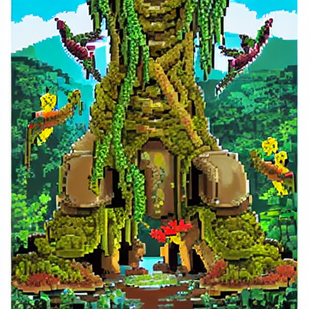<br/><sub><b>Pixel Art Scene</b></sub></td>
<td align="center"><br/><sub><b>Pixel Art Scene</b></sub></td>
</tr>
<tr>
<td align="center">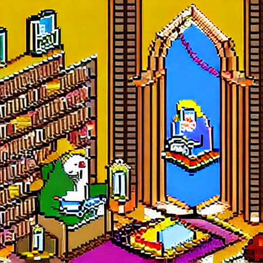<br/><sub><b>Wizard Library</b></sub></td>
<td align="center">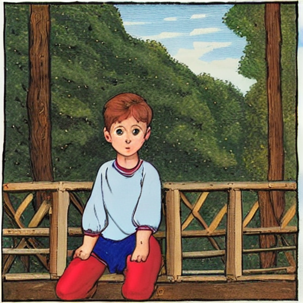<br/><sub><b>Pixel Art Scene</b></sub></td>
<td align="center">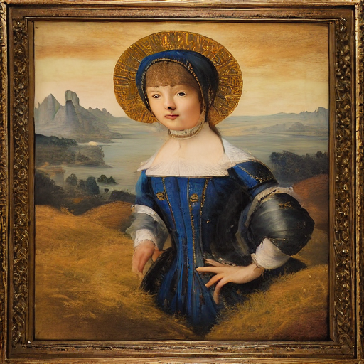<br/><sub><b>Pixel Art Scene</b></sub></td>
</tr>
</table>
</div>

### Base Model vs. Fine-Tuned Model Comparison

| Base SD v1.5 (No Fine-Tuning) | Fine-Tuned LoRA Model |
|:---:|:---:|
| 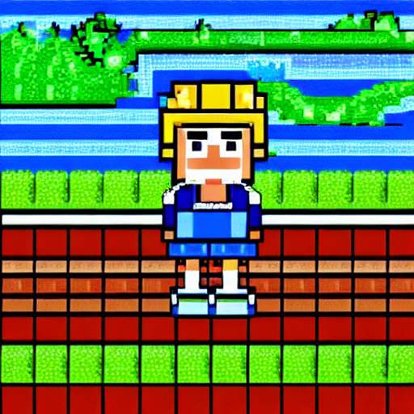 |  |
| Generic output — model doesn't understand pixel art style | Strong pixel art adherence via learned `pixel_art` trigger word |

---

## 📁 Project Structure

```
Pixel Art Generator using Finetuning/
│
├── 📄 README.md                          # This file
├── 📄 .gitignore                         # Git ignore rules
├── 📄 .env                               # API keys (not committed)
├── 📄 project_summary.md                 # Project overview notes
│
├── 🔧 CAPTIONING SCRIPTS
│   ├── image_discription_geminiapi.py    # Gemini API dual-model captioner
│   ├── image_discription_nvapi.py        # NVIDIA API (Llama 3.2 90B Vision) captioner
│   └── image_discription_offline.py      # Local Ollama (Qwen3-VL 4B) captioner
│
├── 🔧 DATA PROCESSING
│   ├── prepare_dataset.py                # Resize images + generate metadata.jsonl
│   └── clean_metadata.py                 # Clean captions (remove style-leak words)
│
├── 🧠 TRAINING
│   └── train_lora.py                     # LoRA fine-tuning with extreme memory opts
│
├── 🎨 INFERENCE
│   ├── generate_image.py                 # CPU inference (GGUF quantized model)
│   ├── generate_image_gpu.py             # GPU inference (base SD v1.5)
│   ├── generate_image_gpu_finetuned.py   # GPU inference (fine-tuned merged model)
│   ├── generate_image_pixel_art_xl.py    # GPU inference (nerijs/pixel-art-xl LoRA)
│   └── generate_sample.py               # CLI sample generator with argparse
│
├── 🌐 WEB APPLICATIONS
│   ├── server.py                         # Flask backend + API endpoints
│   ├── app_Streamlit.py                  # Streamlit interactive UI
│   └── frontend/                         # Custom Neo-Brutalist web frontend
│       ├── index.html
│       ├── style.css
│       └── app.js
│
├── 📂 output/                            # Generated images
│   ├── with_finetuning/                  # ✅ Results from fine-tuned model
│   ├── without_finetuning/               # Baseline results from vanilla SD v1.5
│   └── pixel_art_xl/                     # Results from pixel-art-xl LoRA
│
├── 📂 raw_data/                          # (not committed) Raw source datasets
├── 📂 processed_data/                    # (not committed) AI-captioned images
├── 📂 processed_data_resized/            # (not committed) 512×512 training-ready images
├── 📂 outputs/                           # (not committed) Checkpoints & merged model
│   ├── checkpoints/                      # LoRA checkpoint saves every 1000 steps
│   └── merged_model/                     # Final merged SD pipeline
└── 📂 venv/                              # (not committed) Python virtual environment
```

---

## 📝 Step-by-Step Guide

### Step 1: Environment Setup

#### Prerequisites

- **OS:** Windows 10/11 (tested), Linux also compatible
- **GPU:** NVIDIA GPU with ≥6GB VRAM (tested on RTX 4050 Laptop)
- **CUDA:** 11.8 or 12.x with compatible cuDNN
- **Python:** 3.10+

#### Installation

```bash
# Clone the repository
git clone https://github.com/RKBehera223048/Pixel-Art-Generator-using-Finetuning.git
cd Pixel-Art-Generator-using-Finetuning

# Create and activate virtual environment
python -m venv venv
venv\Scripts\activate        # Windows
# source venv/bin/activate   # Linux/macOS

# Install PyTorch with CUDA support
pip install torch torchvision --index-url https://download.pytorch.org/whl/cu121

# Install remaining dependencies
pip install diffusers transformers accelerate peft bitsandbytes
pip install Pillow tqdm python-dotenv
pip install flask flask-cors streamlit
pip install google-genai openai aiohttp
```

#### API Keys (for captioning only)

Create a `.env` file in the project root:

```env
GEMINI_API_KEY=your_gemini_api_key_here
NVIDIA_API_KEY=your_nvidia_api_key_here
```

> **Note:** API keys are only needed for the captioning step. Training and inference do not require any API keys.

---

### Step 2: Dataset Collection

The training pipeline uses **three distinct pixel art datasets** sourced from different locations:

| Dataset | Source | Description | Count |
|---------|--------|-------------|-------|
| `kansallisgalleria-SCRT-Dataset-HF` | Hugging Face | Finnish National Gallery art collection — high-resolution art pieces with descriptive filenames | ~3,000 |
| `diffusiondb-pixelart` | DiffusionDB subset | Curated pixel art subset from the DiffusionDB dataset | ~5,000 |
| `pixel art` | Various | Hand-curated pixel art sprites, characters, and scenes | ~5,000 |

**Directory structure after collection:**
```
raw_data/
├── kansallisgalleria-art-images-dataset/
│   └── kansallisgalleria-SCRT-Dataset-HF/    # Art pieces with long descriptive filenames
├── diffusiondb-pixelart/                       # Pixel art from DiffusionDB
└── pixel art/                                  # Additional curated pixel art
```

> **Key Challenge:** The Finnish gallery dataset had extremely long filenames that exceeded Windows' 260-character path limit, and images were very high resolution (often 4000×6000+ pixels). These challenges are handled automatically by the preprocessing scripts.

---

### Step 3: AI-Powered Image Captioning

Generating high-quality captions is **critical** for fine-tuning. Poor captions = poor model. This project implements **three parallel captioning engines** to maximize throughput and quality:

#### 3a. Gemini API Captioner (`image_discription_geminiapi.py`)

Uses Google's **Gemma 4 26B** and **Gemma 4 31B** models in a dual-model configuration:

```python
MODELS = [
    {"id": "gemma-4-26b-a4b-it", "label": "Gemma4-26B", "rpm": 5, "concurrent": 1},
    {"id": "gemma-4-31b-it",     "label": "Gemma4-31B", "rpm": 5, "concurrent": 1},
]
```

**Key features:**
- **Dual-model round-robin** — distributes images across both models to double throughput
- **Per-model rate limiting** — each model has its own rate limiter (5 RPM each = 10 RPM total)
- **Resume support** — saves progress to `_processing_progress.json` after every batch
- **Exponential backoff** — retries failed requests up to 5 times with increasing delays
- **Image preprocessing** — resizes images to max 1024px and converts to JPEG before sending

```bash
# Run the Gemini captioner
python image_discription_geminiapi.py
```

#### 3b. NVIDIA API Captioner (`image_discription_nvapi.py`)

Uses **Meta's Llama 3.2 90B Vision Instruct** model via the NVIDIA API:

```python
MODELS = [
    {"id": "meta/llama-3.2-90b-vision-instruct", "label": "Llama3.2-90B-Vision", "rpm": 20, "concurrent": 3},
]
```

**Design decision:** This script processes images from different source directories (`diffusiondb-pixelart` and `pixel art`) and can run **simultaneously** with the Gemini captioner without collision, since they read from different raw data folders and track progress separately.

```bash
# Run the NVIDIA API captioner (can run in parallel with Gemini captioner)
python image_discription_nvapi.py
```

#### 3c. Offline Captioner (`image_discription_offline.py`)

Uses a **locally running Ollama model** (`qwen3-vl:4b`) for zero-cost, offline captioning:

```python
OLLAMA_API_URL = "http://localhost:11434/api/generate"
MODEL_NAME = "qwen3-vl:4b"
```

**Requirements:** Install [Ollama](https://ollama.ai) and pull the model:
```bash
ollama pull qwen3-vl:4b
```

```bash
# Run the offline captioner
python image_discription_offline.py
```

#### The Captioning Prompt

All three engines use the same carefully engineered prompt:

```
You are an expert art captioner creating training data for a diffusion model.

Analyze this artwork image and produce a SINGLE detailed caption that describes:
1. The subject matter (what is depicted - people, landscapes, objects, scenes)
2. The art style and medium (pixel art, character design, environment, etc.)
3. The color palette and lighting (warm tones, cool blues, dramatic shadows, etc.)
4. The composition and mood (serene, dramatic, intimate, grand, etc.)
5. Any notable artistic techniques or features

Rules:
- Write ONE continuous sentence or two short sentences (no bullet points)
- Be specific and descriptive, avoid vague terms
- Use natural language suitable for text-to-image model training
- Keep it between 30-80 words
- Do NOT include the artist name or title
- Do NOT start with "This is" or "The image shows"
- Focus on visual content that would help a model recreate this image
```

**Example output:** *"A retro pixel art character in a cyber suit, 16-bit style with neon pink and cyan accents, dynamic pose, dark background, cyberpunk aesthetic"*

---

### Step 4: Dataset Preparation & Preprocessing (`prepare_dataset.py`)

After captioning, images need to be **standardized** for training:

```bash
python prepare_dataset.py
```

**What this script does:**

1. **Reads the AI-generated captions** from the `_metadata.csv` file produced by the captioners
2. **Recursively crawls** the `processed_data/pixel art/` directory for all image files
3. **Resizes all images to 512×512** using Lanczos resampling for high-quality downscaling
4. **Renames files sequentially** (`image_00001.png`, `image_00002.png`, ...) to avoid Windows path-length issues caused by the extremely long caption-based filenames
5. **Prepends the trigger word** `pixel_art` to every caption (e.g., `pixel_art, a cozy medieval tavern...`)
6. **Generates `metadata.jsonl`** — a Hugging Face-compatible dataset file where each line maps a filename to its caption:

```json
{"file_name": "image_00001.png", "text": "pixel_art, a retro character in a cyber suit with neon accents"}
{"file_name": "image_00002.png", "text": "pixel_art, a serene lakeside landscape at golden hour"}
```

**Output directory:** `processed_data_resized/` containing all 512×512 images and the `metadata.jsonl`.

> **Why 512×512?** Stable Diffusion v1.5 was trained at 512×512 resolution. Using matching dimensions avoids quality degradation from resolution mismatch.

---

### Step 5: Caption Cleaning & Normalization (`clean_metadata.py`)

The AI-generated captions often contain **style-leaking words** that would fight against the LoRA's learned style. This script removes them:

```bash
python clean_metadata.py
```

**Words removed:**
```python
phrases_to_remove = [
    'pixel_art', 'digital', 'artwork', 'pixel art', 'abstract',
    'cartoon', 'cartoon-style', 'iconic', 'video game', 'video game art',
    'game', 'illustration', 'illustrated', 'digitally', 'pixelated',
    'pixel', 'art', '8-bit', '8 bit', 'low resolution'
]
```

**Why?** The LoRA is specifically learning to map the `pixel_art` trigger word to the pixel art style. If captions already contain words like "pixelated", "8-bit", or "digital artwork", it creates confusion — the model doesn't learn that `pixel_art` is THE trigger for the style. By cleaning these words, we force the model to associate the style **exclusively** with our trigger word.

**Before cleaning:**
```
pixel_art, A pixelated cartoon-style illustration of a knight in 8-bit pixel art style with bold colors
```

**After cleaning:**
```
A of a knight in style with bold colors
```

> **Note:** The regex-based removal strips style-related words while preserving descriptive content like colors, composition, and subjects. The AI captioners generally produce rich enough descriptions that removing style keywords still leaves meaningful captions for training.

---

### Step 6: LoRA Fine-Tuning (`train_lora.py`)

This is the core of the project — training a LoRA adapter on top of Stable Diffusion v1.5:

```bash
python train_lora.py
```

#### How It Works

**1. Model Loading**

```python
base_model = "runwayml/stable-diffusion-v1-5"
tokenizer = CLIPTokenizer.from_pretrained(base_model, subfolder="tokenizer")
text_enc  = CLIPTextModel.from_pretrained(base_model, subfolder="text_encoder")
vae       = AutoencoderKL.from_pretrained(base_model, subfolder="vae")
unet      = UNet2DConditionModel.from_pretrained(base_model, subfolder="unet")
```

The pipeline loads four components: tokenizer, text encoder (CLIP), VAE (encoder/decoder), and UNet (the denoising backbone).

**2. Freezing & LoRA Injection**

```python
# Freeze everything except LoRA weights
vae.requires_grad_(False)
text_enc.requires_grad_(False)
unet.requires_grad_(False)

# Inject LoRA matrices into UNet cross-attention layers
lora_cfg = LoraConfig(
    r=32,                    # LoRA rank — higher = more capacity
    lora_alpha=16,           # Scaling factor
    lora_dropout=0.05,       # Regularization
    target_modules=["to_q", "to_k", "to_v", "to_out.0"],  # Cross-attention projections
    bias="none",
)
unet = get_peft_model(unet, lora_cfg)
```

**What is LoRA?** Instead of fine-tuning all ~860M parameters of the UNet, LoRA injects small trainable matrices (rank `r=32`) into the cross-attention layers. This reduces trainable parameters from **~860M → ~6.8M** (< 1%), making training feasible on low-VRAM GPUs.

**Target modules explained:**
- `to_q` — Query projection in cross-attention (how the model "asks questions" about the image)
- `to_k` — Key projection (how text features are "indexed")
- `to_v` — Value projection (what text information flows into image generation)
- `to_out.0` — Output projection of the attention block

**3. Memory Optimizations**

```python
unet.enable_gradient_checkpointing()              # Trade compute for memory
optimizer = bnb.optim.AdamW8bit(unet.parameters(), lr=1e-4)  # 8-bit optimizer
scaler = torch.cuda.amp.GradScaler()               # Mixed precision (FP16)
```

See [Memory Optimization Techniques](#-memory-optimization-techniques) for details.

**4. Training Loop**

```python
for epoch in range(epochs):
    for batch in dataloader:
        with torch.cuda.amp.autocast():  # FP16 forward pass
            latents = vae.encode(pixel_values).latent_dist.sample()
            noise = torch.randn_like(latents)
            timesteps = torch.randint(0, num_train_timesteps, ...)
            noisy_latents = noise_scheduler.add_noise(latents, noise, timesteps)
            encoder_hidden_states = text_enc(input_ids)[0]
            model_pred = unet(noisy_latents, timesteps, encoder_hidden_states).sample
            loss = F.mse_loss(model_pred, noise, reduction="mean")

        scaler.scale(loss).backward()
        scaler.step(optimizer)
        scaler.update()
```

The training follows the standard diffusion model training procedure:
1. Encode the image to latent space using the frozen VAE
2. Add random noise at a random timestep
3. Ask the UNet to predict the noise
4. Compute MSE loss between predicted and actual noise
5. Backpropagate through the LoRA weights only

**5. Automatic Merging**

After training, the LoRA weights are merged back into the base model for easy deployment:

```python
pipe = StableDiffusionPipeline.from_pretrained(base_model)
pipe.unet = PeftModel.from_pretrained(pipe.unet, lora_save_path)
pipe.unet = pipe.unet.merge_and_unload()  # Merge LoRA → base weights
pipe.save_pretrained("outputs/merged_model")
```

This creates a standalone model that doesn't need PEFT at inference time.

---

### Step 7: Inference & Generation

#### Base Model (without fine-tuning)

```bash
python generate_image_gpu.py
```

Loads vanilla `runwayml/stable-diffusion-v1-5` and generates with pixel art prompts. Outputs go to `output/without_finetuning/`.

#### Fine-Tuned Model

```bash
python generate_image_gpu_finetuned.py
```

Loads the locally merged model from `outputs/merged_model/` and generates pixel art. Outputs go to `output/with_finetuning/`.

**Example prompt used:**
```python
prompt = "a pixel art of attention_to_detail, depicting an old wizard reading in a cozy candlelit stone library, featuring tall bookshelves, a roaring fireplace, an owl stained glass window, and a sleeping golden dragon on a side table, 16-bit"
negative_prompt = "ugly, blurry, photorealistic, 3d render"
```

**Key inference parameters:**
| Parameter | Value | Why |
|-----------|-------|-----|
| `num_inference_steps` | 50 | Higher steps = more refined details |
| `guidance_scale` | 9.0 | Strong prompt adherence for stylistic consistency |
| `width × height` | 512 × 512 | Matches training resolution |
| `torch_dtype` | `float16` | Reduces VRAM usage by 50% |

#### CLI Generator with Custom Prompts

```bash
python generate_sample.py --prompt "A beautiful sunset over the mountains" --out outputs/samples/sunset.png
```

This script automatically wraps your prompt with the trigger words: `pixel_art, {your prompt}, pixelated, 16-bit`.

#### Pixel Art XL (Community LoRA)

For comparison, there's also a script to use the community `nerijs/pixel-art-xl` LoRA on SDXL:

```bash
python generate_image_pixel_art_xl.py
```

---

### Step 8: Web Application

The project includes **two web interfaces** for interactive generation:

#### Option A: Flask + Custom Frontend (Neo-Brutalist UI)

```bash
python server.py
# Open http://localhost:5000
```

Features:
- 🎨 Neo-Brutalist design with pixel art aesthetic
- 🖼 Interactive generation studio with real-time parameter tuning
- 📊 Pipeline architecture visualization
- 🖼 Auto-saving gallery of all generated images
- 🔽 One-click image download
- 📱 Fully responsive design

#### Option B: Streamlit App

```bash
streamlit run app_Streamlit.py
# Open http://localhost:8501
```

Features:
- ⚙️ Sidebar with all generation parameters
- 📝 Prompt engineering with positive/negative prompts
- 💾 Optional local file saving
- 🖼 Live preview of generated images

---

## ⚙ Training Configuration

| Parameter | Value | Notes |
|-----------|-------|-------|
| **Base Model** | `runwayml/stable-diffusion-v1-5` | Stable Diffusion v1.5 |
| **LoRA Rank (r)** | 32 | Higher rank captures finer stylistic details |
| **LoRA Alpha** | 16 | Scaling factor (alpha/rank = 0.5) |
| **LoRA Dropout** | 0.05 | Light regularization |
| **Target Modules** | `to_q`, `to_k`, `to_v`, `to_out.0` | UNet cross-attention projections |
| **Learning Rate** | 1e-4 | Standard for LoRA fine-tuning |
| **Optimizer** | 8-bit AdamW (bitsandbytes) | Cuts optimizer VRAM by ~60% |
| **Batch Size** | 1 | Maximum for 6GB VRAM |
| **Epochs** | 4 | ~52,000 total steps |
| **Checkpoint Interval** | Every 1,000 steps | Saved to `outputs/checkpoints/` |
| **Mixed Precision** | FP16 (autocast + GradScaler) | Halves activation memory |
| **Gradient Checkpointing** | Enabled | Trades compute for memory |
| **Image Resolution** | 512 × 512 | Matches SD v1.5 native resolution |
| **Dataset Size** | ~13,000 images | Combined from 3 sources |

---

## 🧠 Memory Optimization Techniques

Running LoRA training on a **6GB VRAM** GPU requires aggressive memory management:

| Technique | VRAM Saved | How It Works |
|-----------|------------|--------------|
| **LoRA (r=32)** | ~90% | Only trains 6.8M params instead of 860M |
| **Frozen VAE & Text Encoder** | ~2.5GB | These models run in eval mode with `requires_grad_(False)` |
| **FP16 Inference for VAE/TextEnc** | ~50% | Frozen models loaded in `torch.float16` |
| **8-bit AdamW** | ~60% | `bitsandbytes` quantizes optimizer states from FP32 to INT8 |
| **Gradient Checkpointing** | ~40% | Recomputes activations during backward instead of storing them |
| **Mixed Precision (AMP)** | ~30% | Forward pass in FP16, loss scaling prevents underflow |
| **Batch Size 1** | Maximum | Only one image processed at a time |

**Estimated VRAM usage breakdown:**
```
UNet (FP32, LoRA only):     ~3.4 GB
VAE (FP16, frozen):         ~0.3 GB
Text Encoder (FP16, frozen):~0.5 GB
Activations + Gradients:    ~1.5 GB
Optimizer States (8-bit):   ~0.2 GB
─────────────────────────────────────
Total:                      ~5.9 GB  ✅ Fits in 6GB!
```

---

## 🛠 Technologies Used

| Category | Technology | Purpose |
|----------|-----------|---------|
| **ML Framework** | PyTorch 2.x | Core training & inference |
| **Diffusion Models** | 🤗 Diffusers | Stable Diffusion pipeline |
| **Fine-Tuning** | 🤗 PEFT (LoRA) | Parameter-efficient training |
| **Optimization** | bitsandbytes | 8-bit optimizers |
| **Text Encoding** | 🤗 Transformers (CLIP) | Text-to-embedding conversion |
| **Captioning** | Gemini API, NVIDIA API, Ollama | Multi-engine image captioning |
| **Vision Model** | Llama 3.2 90B Vision | Image understanding for captions |
| **Local Vision** | Qwen3-VL 4B (via Ollama) | Offline captioning |
| **Web Backend** | Flask + Flask-CORS | REST API for generation |
| **Web Frontend** | HTML/CSS/JS | Neo-Brutalist interactive UI |
| **Streamlit** | Streamlit | Alternative interactive UI |
| **Image Processing** | Pillow (PIL) | Resizing, format conversion |

---

## 🙏 Acknowledgements

- [Stability AI](https://stability.ai/) — Stable Diffusion v1.5
- [Hugging Face](https://huggingface.co/) — Diffusers, Transformers, PEFT libraries
- [bitsandbytes](https://github.com/TimDettmers/bitsandbytes) — 8-bit optimizer implementation
- [nerijs/pixel-art-xl](https://huggingface.co/nerijs/pixel-art-xl) — Community pixel art LoRA for SDXL comparison
- [Finnish National Gallery](https://www.kansallisgalleria.fi/) — Art dataset
- [DiffusionDB](https://huggingface.co/datasets/poloclub/diffusiondb) — Pixel art subset
- [Ollama](https://ollama.ai/) — Local model inference
- [Google Gemini](https://ai.google.dev/) — Cloud-based image captioning
- [NVIDIA NIM](https://build.nvidia.com/) — Cloud-based vision model inference

---

<div align="center">

**Built with ❤️ and a 6GB GPU**

*If this project helped you, consider giving it a ⭐!*

</div>

